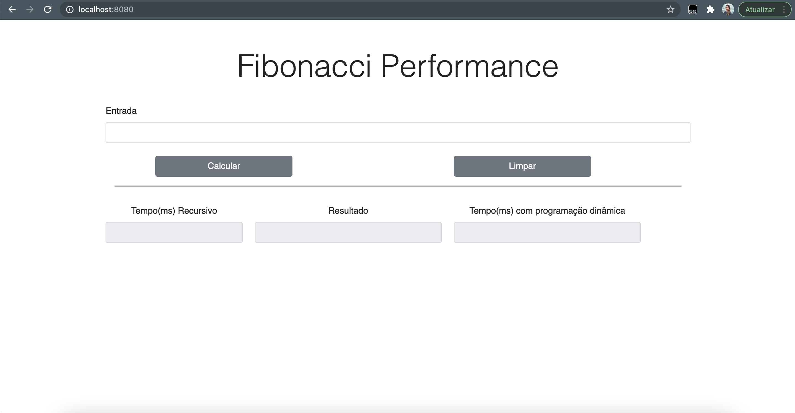
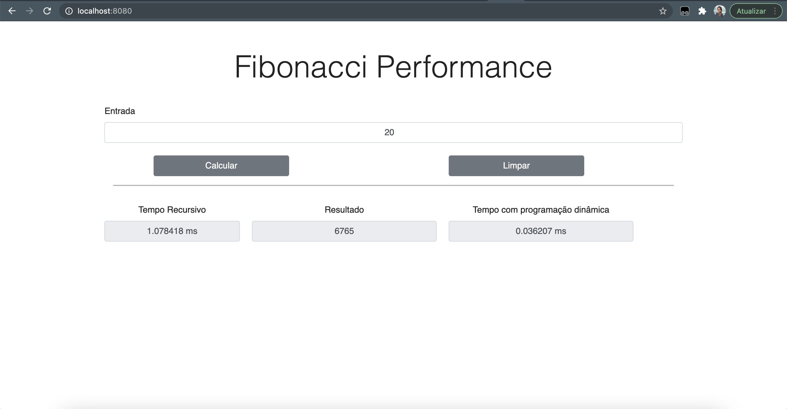
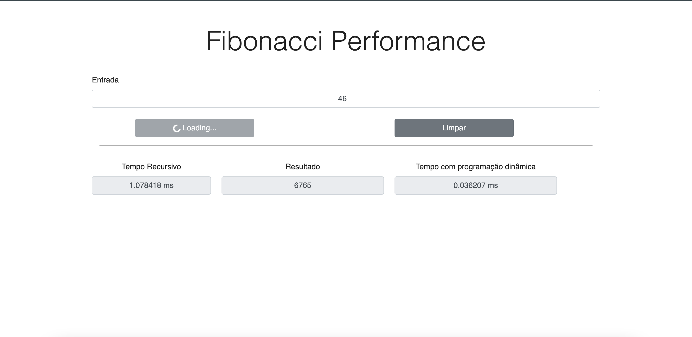
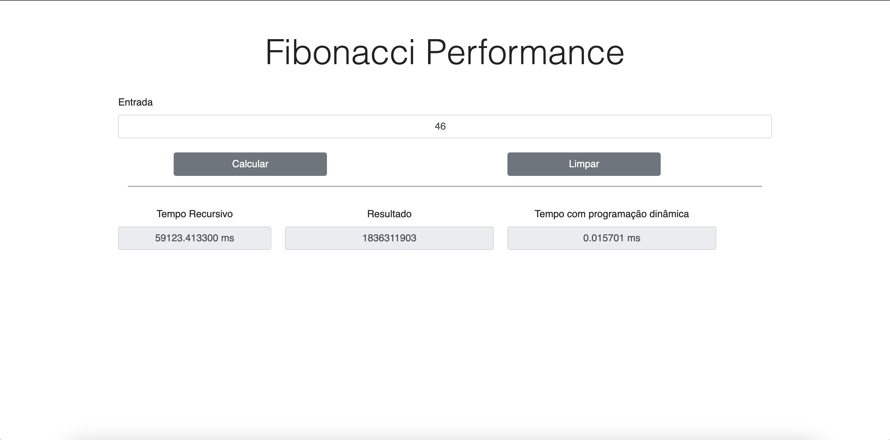
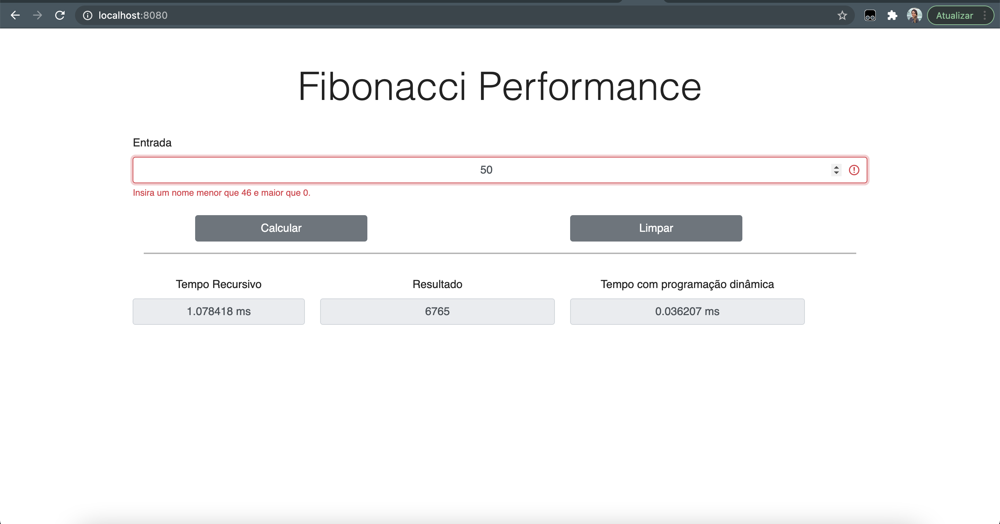

# FibonacciPerformance

**Número da Lista**: 11<br>
**Conteúdo da Disciplina**: PD - Programação dinâmica<br>

## Alunos
|Matrícula | Aluno |
| -- | -- |
| 18/0103580 |  Jonathan Jorge Barbosa Oliveira |
| 19/0063441  |  Ana Carolina Carvalho da Silva|

## Sobre 

#### Definição

O projeto tem como objetivo aplicar a técnica de programação dinâmica para reduzir a complexidade da função de fibonacci recursiva de O(2^n), para O(n). Para isso, introduziremos resumidamente como funciona essa sequência.

Na matemática, a Sequência de Fibonacci, é uma sequência de números inteiros, começando por 0 e 1, na qual, cada termo subsequente corresponde à soma dos dois anteriores. 

Em termos matemáticos, a sequência é definida recursivamente pela fórmula abaixo, sendo o primeiro termo F1= 1:

<p align="center">
F(n) = F(n-1) + F(n-2)
</p>

#### Abordagem recursiva

A própria definição da sequência de Fibonacci pode ser tomada como base para implementar um algoritmo recursivo que gera os termos da sequência, como é mostrado a seguir:

```c
int fibRec(int n)
    if (n<2)
        return n;
    else
        return (n-1) + (n-2);
```

Apesar de simples, essa estratégia não é recomendável porque os mesmos valores são calculados muitas vezes. Uma análise cuidadosa mostra que a complexidade computacional do algoritmo é O(2^n). 

#### Abordagem programação dinâmica

Outra forma de implementar a sequência de Fibonacci é usando programação dinâmica, onde guardamos os valores já calculados. Sendo esta a forma mais otimizada.

```c
int fibPD(int n){
    if (n == 0 or n == 1)
        return n;

    if (v[n] != -1)
        return v[n];

    int res = fibPD(n - 1) + fibPD(n - 2);

    v[n] = res;
    return res;
}
```

A ideia é simplesmente armazenar os resultados dos subproblemas, para que não tenhamos que recalculá-los quando for necessário posteriormente. Essa otimização simples reduz as complexidades de tempo de exponencial para polinomial. Uma análise cuidadosa mostra que a complexidade computacional do algoritmo cai para O(n). 

## Screenshots

Tela principal da aplicação:



Cálculo feito para encontrar o 20 elemento da sequência, com os tempos que cada implementação teve:



Quando inserido valores mais altos, é necessário esperar que o cálculo seja feito. Para que não pareça que a aplicação está travada, há uma mensagem de "loading" no botão de "Calcular":



Mais um resultado com valor alto. Note a diferença entre os tempos:



Para evitar grandes demoras, limitamos a entrada a 46:



## Apresentação
- O Video de apresentação está na pasta "Media" desse repositório

## Instalação 

**Linguagem**: Javascript
**Framework**: Node

É necessário a instalação do Node.

Para clonar e rodar a aplicação, são necessários: [Git](https://git-scm.com), [Node](https://nodejs.org/pt-br/) instalados.

Para rodar o projeto você precisará rodar os seguintes comandos no terminal do seu computador:

#### Clone este repositório
```bash
cd ~/your/directory/
git clone https://github.com/projeto-de-algoritmos/PD_FibonacciPerformance.git
````

#### Vá para o diretório da aplicação
```bash
cd PD_FibonacciPerformance.
````

#### Construa a aplicação

Em abas separadas do terminal você deverá rodar:

``` bash
    cd PD_FibonacciPerformance/backend 
    npm install
    npm start
```
``` bash
    cd PD_FibonacciPerformance./frontend
    npm install
    npm start
```

#### Acesse o seguinte link em seu navegador

O servidor poderá ser acessado em http://localhost:3000 enquanto o frontend será acessado em http://localhost:8080

## Uso 


## Contribuintes 

[ <br> <sub> Ana Carvalho </sub>](https://github.com/anacarolcs)|[ <br> <sub> Jonathan Oliveira </sub>](https://github.com/Jonathan-Oliveira) |
| :---: | :---: |

## Outros 
Quaisquer outras informações sobre seu projeto podem ser descritas abaixo.


